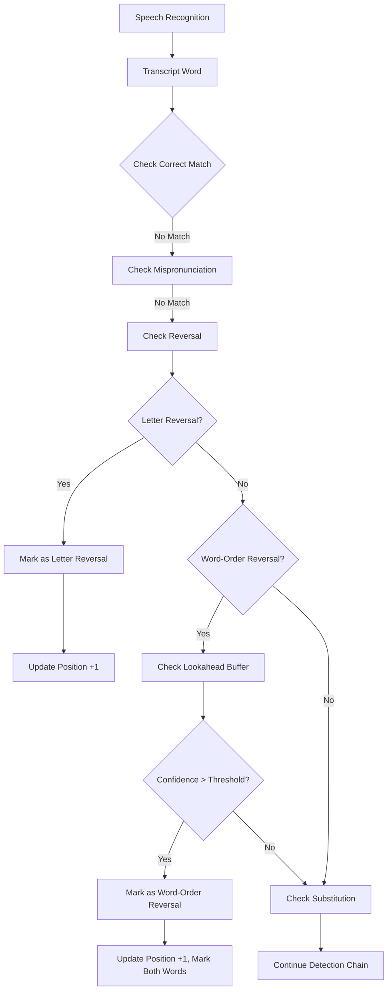

# Reversal Detection Accuracy - Design Document

## Overview

This design improves the accuracy of reversal miscue detection in the Phil-IRI reading assessment system. The current implementation in `DETECTION/reversal.ts` detects two types of reversals:

1. **Letter-level reversals**: When a student reads a word with letters reversed (e.g., "was" → "saw", "pot" → "top")
2. **Word-order reversals**: When a student reads two adjacent words in reversed order (e.g., "big dog" → "dog big")

### Current Implementation Gaps

Analysis of the existing code reveals several accuracy issues:

**Gap 1: Limited Context Window**
- Current implementation only checks if spoken word matches the next word (position + 1)
- Cannot detect reversals where the student reads ahead by 2+ words
- Example: Student reads word at position+2, system doesn't recognize it as a potential reversal

**Gap 2: Pronunciation Matching Limitations**
- Uses `checkPronunciationMatch` from `correct.ts` which has a fixed dictionary
- Dictionary may not cover all pronunciation variants for reversed words
- No phonetic similarity scoring for near-matches

**Gap 3: Edge Case Handling**
- Handles end-of-story correctly (no next word available)
- Handles empty/whitespace inputs correctly
- Does NOT handle very short words (1-2 letters) differently, which may cause false positives
- Example: "I" reversed is "I", "a" reversed is "a" - these should not be flagged as letter reversals

**Gap 4: Integration Timing**
- Called in `ReadingSessionPage.tsx` during real-time speech processing
- May be called before the next word is fully available in the transcript
- No buffering or lookahead mechanism to wait for more context

**Gap 5: State Management**
- When a reversal is detected, position advances by 1
- Does not handle the case where both words in a reversal should be marked
- Example: "big dog" → "dog big" should mark both positions, not just one

### Proposed Improvements

**Improvement 1: Enhanced Context Window**
- Check up to 3 words ahead (configurable)
- Return confidence score based on how far ahead the match is
- Prioritize closer matches over distant ones

**Improvement 2: Phonetic Similarity Scoring**
- Implement Levenshtein distance for near-matches
- Use phonetic algorithms (Metaphone, Soundex) for pronunciation variants
- Set threshold for acceptable similarity (e.g., 80% match)

**Improvement 3: Short Word Filtering**
- Skip letter-reversal check for words ≤ 2 characters
- These are too short to meaningfully reverse
- Reduces false positives

**Improvement 4: Buffered Detection**
- Implement a lookahead buffer in ReadingSessionPage.tsx
- Wait for N words before finalizing reversal detection
- Allows more context for accurate detection

**Improvement 5: Dual-Position Marking**
- When word-order reversal detected, mark both positions
- Track which word was skipped and which was read out of order
- Provide clear visual feedback for both words

## Architecture

### Component Structure

```
DETECTION/
├── reversal.ts (enhanced)
│   ├── detectReversal() - main detection function
│   ├── checkLetterReversal() - letter-level detection
│   ├── checkNextWordMatch() - word-order detection (enhanced)
│   ├── checkPhoneticSimilarity() - NEW: phonetic matching
│   └── calculateReversalConfidence() - NEW: confidence scoring
│
├── correct.ts (existing)
│   ├── normalizeWord()
│   ├── checkPronunciationMatch()
│   └── pronunciation dictionaries
│
└── phonetic.ts (NEW)
    ├── levenshteinDistance()
    ├── metaphoneMatch()
    └── calculatePhoneticScore()

frontend/src/pages/teacher/
└── ReadingSessionPage.tsx (modified)
    ├── Reversal detection integration (lines 931-948)
    ├── Add lookahead buffer
    ├── Add dual-position marking
    └── Enhanced logging
```

### Data Flow



### Integration Points

**1. ReadingSessionPage.tsx (Line 932)**
```typescript
// Current integration
const reversalResult = detectReversal(
  filteredText, 
  expectedWord, 
  nextWord, 
  currentWordIndex, 
  { language: storyLanguage }
);
```

**Enhanced integration:**
```typescript
// Enhanced integration with lookahead buffer
const lookaheadWords = words.slice(currentWordIndex + 1, currentWordIndex + 4);
const reversalResult = detectReversal(
  filteredText,
  expectedWord,
  lookaheadWords,
  currentWordIndex,
  {
    language: storyLanguage,
    maxLookahead: 3,
    confidenceThreshold: 0.8,
    enablePhonetic: true
  }
);
```

**2. WordStateManager Integration**
```typescript
// Current: single word marking
wordStateManager.updateWordStatus(currentWordIndex, 'miscue', 'reversal', filteredText);

// Enhanced: dual-position marking for word-order reversals
if (reversalResult.reversalType === 'word-order') {
  wordStateManager.updateWordStatus(
    reversalResult.skippedPosition, 
    'miscue', 
    'reversal-skipped', 
    expectedWord
  );
  wordStateManager.updateWordStatus(
    reversalResult.matchedPosition, 
    'miscue', 
    'reversal-matched', 
    filteredText
  );
}
```

## Components and Interfaces

### Enhanced ReversalResult Interface

```typescript
export interface ReversalResult {
  /** Type of match: 'reversal' if words are swapped, 'no_match' otherwise */
  matchType: 'reversal' | 'no_match';
  
  /** Type of reversal detected */
  reversalType?: 'letter' | 'word-order';
  
  /** Whether to advance the reading position */
  advance: boolean;
  
  /** The new position after processing */
  newPosition: number;
  
  /** Number of miscues (1 for reversal, 0 otherwise) */
  miscueCount: number;
  
  /** The word that was expected but skipped (word-order reversals) */
  expectedWord: string | null;
  
  /** The word that was spoken out of order */
  spokenWord: string | null;
  
  /** Position of the word that was skipped (word-order reversals) */
  skippedPosition?: number;
  
  /** Position of the word that matched (word-order reversals) */
  matchedPosition?: number;
  
  /** Confidence score (0.0 to 1.0) */
  confidence?: number;
  
  /** How many words ahead the match was found (0 = next word, 1 = word after next, etc.) */
  lookaheadDistance?: number;
  
  /** Human-readable description of the result */
  details: string;
}
```

### Enhanced ReversalConfig Interface

```typescript
export interface ReversalConfig {
  /** Language mode for pronunciation matching */
  language?: 'english' | 'tagalog';
  
  /** Maximum number of words to look ahead (default: 3) */
  maxLookahead?: number;
  
  /** Minimum confidence threshold for reversal detection (0.0 to 1.0, default: 0.8) */
  confidenceThreshold?: number;
  
  /** Enable phonetic similarity matching (default: true) */
  enablePhonetic?: boolean;
  
  /** Minimum word length for letter-reversal detection (default: 3) */
  minWordLength?: number;
}
```

### New PhoneticScore Interface

```typescript
export interface PhoneticScore {
  /** Levenshtein distance between words */
  editDistance: number;
  
  /** Normalized similarity score (0.0 to 1.0) */
  similarity: number;
  
  /** Whether words match phonetically using Metaphone */
  metaphoneMatch: boolean;
  
  /** Overall phonetic score (0.0 to 1.0) */
  overallScore: number;
}
```

## Data Models

### Reversal Detection State

The reversal detection module is stateless - it processes one word at a time and returns a result. State is managed by the calling component (ReadingSessionPage.tsx).

**Input Data:**
- `spokenWord`: string - The word recognized from speech
- `expectedWord`: string - The expected word at current position
- `lookaheadWords`: string[] - Array of upcoming words (1-3 words)
- `currentPosition`: number - Current position in the story (0-indexed)
- `config`: ReversalConfig - Configuration options

**Output Data:**
- `ReversalResult` - Detection result with match type, confidence, and position updates

### Lookahead Buffer (ReadingSessionPage.tsx)

```typescript
interface LookaheadBuffer {
  /** Words that have been recognized but not yet processed */
  words: string[];
  
  /** Maximum buffer size */
  maxSize: number;
  
  /** Add a word to the buffer */
  add(word: string): void;
  
  /** Get N words from the buffer */
  peek(count: number): string[];
  
  /** Remove and return the first word */
  shift(): string | undefined;
  
  /** Clear the buffer */
  clear(): void;
}
```

### Phonetic Matching Cache

To improve performance, phonetic similarity scores should be cached:

```typescript
interface PhoneticCache {
  /** Map of word pairs to phonetic scores */
  cache: Map<string, PhoneticScore>;
  
  /** Maximum cache size (LRU eviction) */
  maxSize: number;
  
  /** Get or compute phonetic score */
  getScore(word1: string, word2: string): PhoneticScore;
  
  /** Clear the cache */
  clear(): void;
}
```


## Correctness Properties

*A property is a characteristic or behavior that should hold true across all valid executions of a system—essentially, a formal statement about what the system should do. Properties serve as the bridge between human-readable specifications and machine-verifiable correctness guarantees.*

### Property 1: Word-Order Reversal Detection

*For any* pair of adjacent words in a story and any language mode (English or Tagalog), when a student reads the second word before the first word, the system SHALL detect it as a word-order reversal miscue.

**Validates: Requirements 1.1, 1.2**

**Test Strategy:**
- Generate random pairs of adjacent words
- Simulate reading them in reversed order
- Verify `matchType === 'reversal'` and `reversalType === 'word-order'`
- Test with both English and Tagalog language modes
- Verify position advances correctly

### Property 2: Letter-Level Reversal Detection

*For any* word with length ≥ 3 characters and any language mode (English or Tagalog), when a student reads the word with all letters reversed, the system SHALL detect it as a letter-level reversal miscue.

**Validates: Requirements 2.1, 1.2**

**Test Strategy:**
- Generate random words of varying lengths (≥ 3 characters)
- Reverse the letters of each word
- Verify `matchType === 'reversal'` and `reversalType === 'letter'`
- Test with both English and Tagalog language modes
- Exclude palindromes from test generation

### Property 3: Pronunciation Variant Reversal Detection

*For any* word that has pronunciation variants defined in the system, when a student reads a pronunciation variant of the reversed word, the system SHALL still detect it as a reversal miscue.

**Validates: Requirements 1.3**

**Test Strategy:**
- Select words with known pronunciation variants from dictionaries
- Generate reversed versions using pronunciation variants
- Verify system detects reversal despite pronunciation variation
- Test with both exact matches and variant matches

### Property 4: Reversal Type Distinction

*For any* detected reversal, the system SHALL correctly identify whether it is a letter-level reversal or a word-order reversal, and these SHALL be mutually exclusive categories.

**Validates: Requirements 2.2**

**Test Strategy:**
- Generate both types of reversals
- Verify `reversalType` field is set correctly
- Verify letter reversals return `reversalType === 'letter'`
- Verify word-order reversals return `reversalType === 'word-order'`
- Verify no reversal is classified as both types

### Property 5: Miscue Count Increment

*For any* detected reversal (either letter-level or word-order), the system SHALL increment the miscue count by exactly 1.

**Validates: Requirements 1.5, 2.3**

**Test Strategy:**
- Generate random reversals of both types
- Verify `miscueCount === 1` for all detected reversals
- Verify `miscueCount === 0` for non-reversals
- Test that multiple reversals accumulate correctly

### Property 6: Normalization Consistency

*For any* word with punctuation, mixed case, or whitespace, the system SHALL normalize it before comparison, and two words that differ only in punctuation, case, or whitespace SHALL be treated as equivalent.

**Validates: Requirements 3.1**

**Test Strategy:**
- Generate random words with various punctuation marks
- Generate same words with different case variations
- Generate same words with leading/trailing whitespace
- Verify all variations are normalized to the same form
- Verify reversal detection works regardless of normalization differences

### Property 7: False Positive Prevention

*For any* pair of words that are phonetically similar but not actual reversals, the system SHALL NOT detect them as reversals.

**Validates: Requirements 4.4**

**Test Strategy:**
- Generate pairs of similar-sounding words that aren't reversals
- Examples: "cat" and "bat", "dog" and "fog", "was" and "has"
- Verify `matchType === 'no_match'` for all non-reversal pairs
- Test with words that have high phonetic similarity scores
- Ensure confidence threshold prevents false positives

### Property 8: Short Word Exclusion

*For any* word with length ≤ 2 characters, the system SHALL NOT perform letter-reversal detection, as these words are too short to meaningfully reverse.

**Validates: Requirements 4.3 (edge case)**

**Test Strategy:**
- Generate words of length 1 and 2
- Attempt letter-reversal detection
- Verify system skips letter-reversal check
- Verify no false positives for palindromic short words ("I", "a")

## Error Handling

### Input Validation

**Empty or Null Inputs:**
- If `spokenWord` is empty, null, or whitespace-only → return `no_match` with `miscueCount: 0`
- If `expectedWord` is empty or null → return `no_match` with `miscueCount: 0`
- If `lookaheadWords` is empty or undefined → skip word-order reversal check, only perform letter-reversal check

**Invalid Position:**
- If `currentPosition < 0` → clamp to 0
- If `currentPosition >= story length` → return `no_match` (end of story)

**Invalid Configuration:**
- If `maxLookahead < 1` → default to 1
- If `maxLookahead > 10` → clamp to 10 (prevent excessive lookahead)
- If `confidenceThreshold < 0` or `> 1` → clamp to [0, 1] range
- If `minWordLength < 1` → default to 3

### Edge Cases

**End of Story:**
- When `currentPosition` is at the last word, `lookaheadWords` will be empty
- System should gracefully handle this by only checking letter-reversal
- Return appropriate `no_match` result if no letter-reversal detected

**Palindromes:**
- Words like "mom", "dad", "noon" are their own reverses
- Letter-reversal check will match, but this is technically correct behavior
- Consider adding palindrome detection to skip these cases

**Very Short Words:**
- Words of length 1-2 should skip letter-reversal check
- Prevents false positives on words like "I", "a", "is", "it"
- Configured via `minWordLength` parameter (default: 3)

**Pronunciation Variants:**
- If a pronunciation variant of a word is also a valid word, this could cause confusion
- Example: "the" → "da" (variant), but "da" might be a word in Tagalog
- System should prioritize exact matches over variant matches

### Error Recovery

**WebSocket Connection Failures:**
- If Vosk connection fails during reversal detection, the detection should still work
- Reversal detection is synchronous and doesn't depend on external services
- Errors should be logged but not thrown

**Performance Degradation:**
- If phonetic matching is slow, consider disabling it via `enablePhonetic: false`
- Cache phonetic scores to avoid recomputation
- Set reasonable timeout for detection (< 50ms per word)

**Memory Management:**
- Lookahead buffer should have a maximum size (default: 10 words)
- Phonetic cache should use LRU eviction (default: 1000 entries)
- Clear caches when session ends to prevent memory leaks

## Testing Strategy

### Dual Testing Approach

This feature requires both **unit tests** and **property-based tests** for comprehensive coverage:

**Unit Tests** focus on:
- Specific examples of reversals (e.g., "was" → "saw", "big dog" → "dog big")
- Edge cases (empty inputs, end of story, short words, palindromes)
- Integration with ReadingSessionPage.tsx
- Error handling and recovery scenarios
- Performance benchmarks (detection < 50ms)

**Property-Based Tests** focus on:
- Universal properties that hold for all inputs
- Randomized testing across many word combinations
- Language-agnostic behavior verification
- Confidence scoring consistency
- Normalization correctness

### Property-Based Testing Configuration

**Library Selection:**
- **TypeScript/JavaScript**: Use `fast-check` library
- Mature, well-maintained, excellent TypeScript support
- Supports custom generators for words, stories, and language modes

**Test Configuration:**
- Minimum **100 iterations** per property test (due to randomization)
- Each test must reference its design document property
- Tag format: `Feature: reversal-detection-accuracy, Property {number}: {property_text}`

**Example Property Test Structure:**
```typescript
import fc from 'fast-check';

describe('Feature: reversal-detection-accuracy, Property 1: Word-Order Reversal Detection', () => {
  it('detects word-order reversals for any pair of adjacent words', () => {
    fc.assert(
      fc.property(
        fc.tuple(fc.string({ minLength: 3 }), fc.string({ minLength: 3 })),
        fc.constantFrom('english', 'tagalog'),
        ([word1, word2], language) => {
          // Test that reading word2 before word1 is detected as reversal
          const result = detectReversal(word2, word1, [word2], 0, { language });
          expect(result.matchType).toBe('reversal');
          expect(result.reversalType).toBe('word-order');
        }
      ),
      { numRuns: 100 }
    );
  });
});
```

### Unit Test Coverage

**Core Functionality:**
- Test `checkLetterReversal()` with known examples
- Test `checkNextWordMatch()` with pronunciation variants
- Test `detectReversal()` with various configurations
- Test confidence scoring with different lookahead distances

**Edge Cases:**
- Empty spoken word → `no_match`
- Empty expected word → `no_match`
- No lookahead words → only letter-reversal check
- End of story → graceful handling
- Short words (1-2 chars) → skip letter-reversal
- Palindromes → correct detection

**Integration Tests:**
- Test integration with ReadingSessionPage.tsx
- Test lookahead buffer behavior
- Test dual-position marking for word-order reversals
- Test miscue counter updates
- Test WordStateManager integration

**Performance Tests:**
- Benchmark detection time (should be < 50ms)
- Test with large lookahead windows (10+ words)
- Test phonetic cache performance
- Test memory usage with long sessions

### Test Data Generation

**Word Generators:**
- English words: Use common word lists (e.g., top 1000 words)
- Tagalog words: Use DepEd-approved word lists
- Pronunciation variants: Use dictionaries from `correct.ts`
- Random strings: Generate for robustness testing

**Story Generators:**
- Short stories (10-20 words)
- Medium stories (50-100 words)
- Long stories (200+ words)
- Mixed language stories (code-switching)

**Reversal Generators:**
- Letter reversals: Reverse string characters
- Word-order reversals: Swap adjacent words
- Pronunciation variant reversals: Use variant dictionaries
- Near-reversals: Generate similar but not reversed words

### Continuous Integration

**Pre-commit Hooks:**
- Run unit tests before commit
- Run linting and type checking
- Ensure no console.log statements in production code

**CI Pipeline:**
- Run all unit tests
- Run all property-based tests (100 iterations each)
- Run integration tests
- Generate coverage report (target: > 90%)
- Run performance benchmarks

**Regression Testing:**
- Maintain a suite of known reversal examples from teacher feedback
- Test against these examples on every commit
- Track accuracy metrics over time

